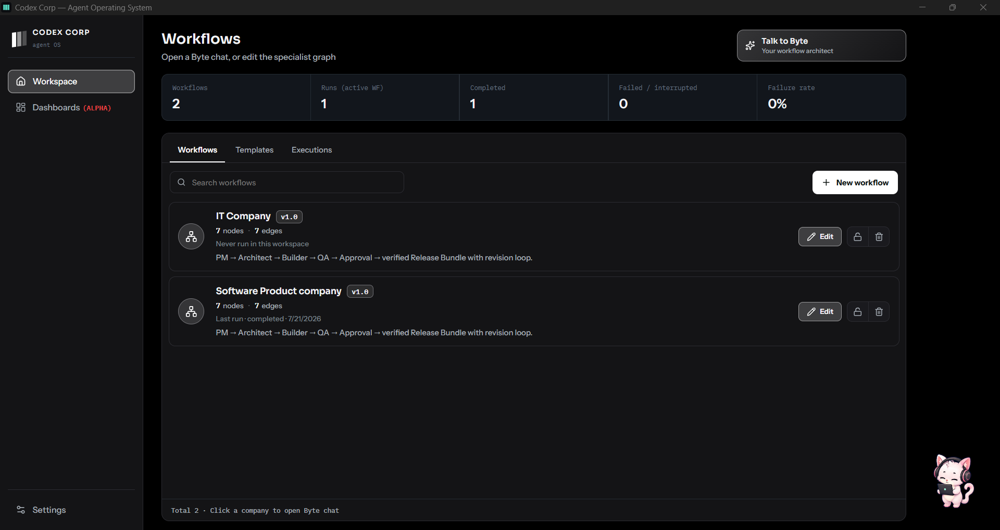
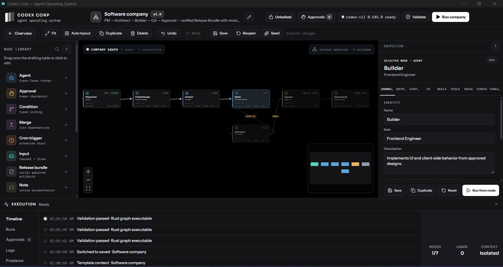
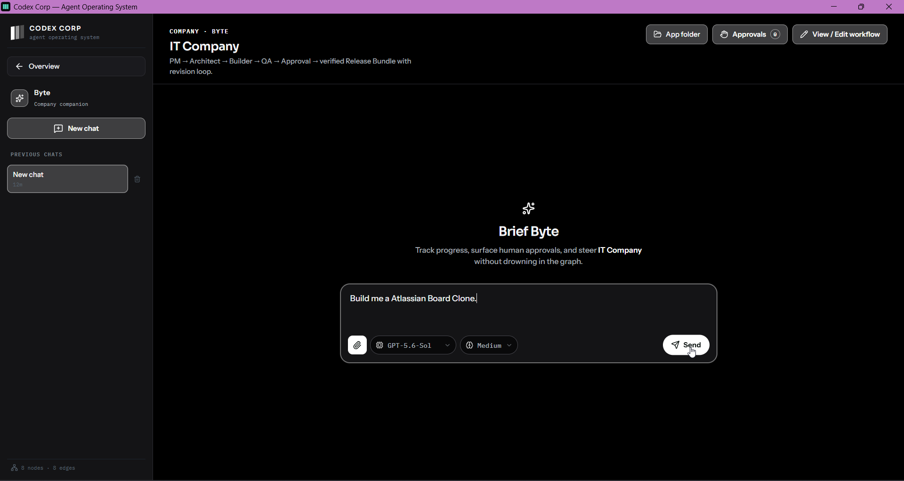

# Codex Corp

Codex Corp is a local agent operating system for assembling and running specialist software companies as visual workflows. You describe the outcome; Byte helps design the team; Live Codex agents execute the graph while the desktop runtime owns scheduling, retries, approvals, persistence, and delivery.

> v0.1 hackathon release — powered by Live Codex and GPT-5.6. No simulated agents, canned model catalog, or browser-only runtime.



## What it does

- **Build a company:** create reusable specialist graphs manually or with Byte, the Workflow Architect.
- **Run real Codex agents:** every agent node is an isolated Live Codex thread using models returned by `model/list`.
- **Keep humans in control:** approval nodes pause execution until an operator approves or declines the work.
- **Recover safely:** Rust owns retries, revision loops, checkpoints, stop behavior, and terminal state.
- **Inspect everything:** follow node state, events, logs, usage, context, and artifacts from one desktop UI.
- **Operate headlessly:** the same runtime exposes authenticated MCP tools over loopback HTTP or stdio.

| Workflow editor | Company companion |
| --- | --- |
|  |  |

_Page.png)

## Install v0.1

Download the latest v0.1 installer from the [GitHub Releases page](https://github.com/suyashkelvinsavant/codex-corp/releases):

- **Windows x64:** NSIS setup executable (`-setup.exe`)
- **Linux x64:** AppImage or Debian package (`.AppImage` / `.deb`)
- **macOS Apple Silicon:** ARM64 disk image (`.dmg`)
- **macOS Intel:** x64 disk image (`.dmg`)

The v0.1 installers are unsigned. Windows SmartScreen and macOS Gatekeeper may warn before opening them. Linux and macOS packages are built by native GitHub-hosted runners; they are not cross-compiled on Windows.

### Runtime requirement

Install and sign in to the [Codex CLI](https://developers.openai.com/codex/cli/) before starting a company run. Codex Corp probes the local CLI's app-server capabilities at launch. Browser-only Vite can edit graphs, but company chat and execution require the desktop or headless runtime.

### Judge testing path — no rebuild required

1. Download the Windows x64 v0.1 setup executable from [GitHub Releases](https://github.com/suyashkelvinsavant/codex-corp/releases).
2. Install and sign in to the Codex CLI, then run the installer and open Codex Corp. No separate Codex Corp account or test credentials are required.
3. Open a seeded workflow, select **Validate**, then start it with **Run company**. Live agent execution uses the locally authenticated Codex CLI.
4. Inspect the execution timeline, node output, usage, context, and approval requests. Company runs fail closed if Live Codex is unavailable or verification fails.

Windows is the primary locally verified v0.1 build. Linux x64 and macOS Apple Silicon/Intel packages are native CI preview builds; their status is stated explicitly below.

## Run from source

Prerequisites: Node.js 22+, Rust stable, platform-specific [Tauri v2 prerequisites](https://v2.tauri.app/start/prerequisites/), and the Codex CLI.

```bash
npm ci
npm run desktop:dev
```

Production checks and local Windows release build:

```bash
npm run build
npm test
cargo test --manifest-path src-tauri/Cargo.toml
npm run desktop:build
```

`npm run desktop:build` creates the verified standalone Windows executable at `release/Codex-Corp.exe`. Installers are built with the GitHub release workflow so each package is produced on its native operating system.

## Architecture

```text
Company chat (operator)
  -> Live Codex mediator thread + host-executed company/node tools

Visual workflow
  -> mission -> specialists -> adversarial review -> human approval -> release bundle
  -> each specialist runs as an isolated Live Codex thread

Rust/Tauri runtime
  -> scheduling, retries, revisions, approvals, checkpoints, persistence, retention
  -> authenticated local MCP server for desktop and headless operation
```

Correctness boundaries are deliberate: free-form chat fails closed when Live Codex is unavailable; specialist timeouts and malformed outputs are failures, not synthetic successes; deterministic validation owns graph and delivery invariants.

## How Codex and GPT-5.6 were used

Codex was the engineering environment throughout Build Week, not a feature added at the end. GPT-5.6 helped trace the TypeScript/Rust/app-server boundaries, design the mediator and workflow contracts, implement the desktop and headless runtimes, and review failure paths. The work was repeatedly checked with adversarial tests around malformed agent output, interrupted approvals, retries, persistence recovery, process lifecycle, and release packaging.

### Collaboration throughout the project

| Phase | Where Codex accelerated the work | Key decision I retained | GPT-5.6 contribution |
| --- | --- | --- | --- |
| Product framing | Compared multi-agent workflow shapes and converted product goals into concrete runtime invariants. | Codex Corp would be a local operating system for visible specialist companies, not another opaque group-chat wrapper. | Helped connect the product promise to explicit operator controls, approvals, and inspectable delivery. |
| Architecture | Traced TypeScript, Tauri, Rust, SQLite, and Codex app-server call paths across the repository. | Rust owns scheduling, retries, persistence, approvals, and terminal state; agents cannot self-certify correctness. | Helped reason across long asynchronous lifecycles and identify the correct ownership boundaries. |
| Implementation | Produced and reviewed cohesive cross-layer patches, typed contracts, migrations, and failure handling. | Only live Codex threads and the live `model/list` catalog are allowed; no simulated specialist output or fake success path. | Implemented substantial runtime, mediator, headless MCP, and workflow behavior under those constraints. |
| Product design | Iterated on the workflow catalog, graph editor, company companion, and Byte Workflow Architect using rendered UI evidence. | Creation stays visible, Byte handles outcome-level conversation, the graph exposes specialist detail, and approval remains a clear human action. | Helped translate those design decisions into consistent React flows and product copy. |
| Verification | Generated adversarial cases, traced failures to their owning layer, and expanded frontend and Rust regression coverage. | Deterministic validators and artifact hashes—not an agent's claim—decide whether delivery passes. | Helped test malformed output, stale threads, interrupted approvals, retry plateaus, recovery, and packaging failures. |
| Release | Diagnosed the standalone WebView failure and tested the corrected packaging path. | A release is invalid unless it uses Tauri `custom-protocol`, produces a real installer, and preserves fail-closed behavior. | Helped build the v0.1 release contract and native multi-platform CI workflow. |

Key decisions remained explicit and verifier-owned:

- Live `model/list` is the only model catalog.
- Rust, not an agent, owns scheduling and terminal state.
- Human approval is a real graph gate.
- Invalid or unverified specialist output cannot become a successful release.
- Release builds must use Tauri's `custom-protocol`; a compiler-successful binary that still points at the Vite development URL is rejected.

## Useful commands

| Command | Purpose |
| --- | --- |
| `npm run desktop:dev` | Desktop development with Vite and the native shell |
| `npm run desktop:build` | Verified standalone Windows executable under `release/` |
| `npm run headless -- start` | Headless runtime and MCP server |
| `npm run build` | Type-check and build the frontend |
| `npm test` | Vitest unit and contract tests |
| `npm run test:e2e` | Playwright UI tests |

See [HEADLESS.md](HEADLESS.md) for MCP authentication, deployment, and operations.

## Local data and privacy

Codex Corp is local-first. Workflow data, run state, logs, and workspaces stay on the machine unless an agent is explicitly authorized to use external services. It does not send analytics or telemetry to a remote service. Retention and log controls are available in Settings.

## Release status

Windows is the primary locally verified platform. The codebase has explicit Windows and Unix process/lifecycle paths, and CI builds native Linux and macOS packages. Linux and macOS v0.1 packages should be treated as preview builds until their first native smoke checks complete.

## License

Codex Corp is released under the [MIT License](LICENSE).
